## Chapter 1

01a.png

01b.png

02.png

03.png

04.png

05.png
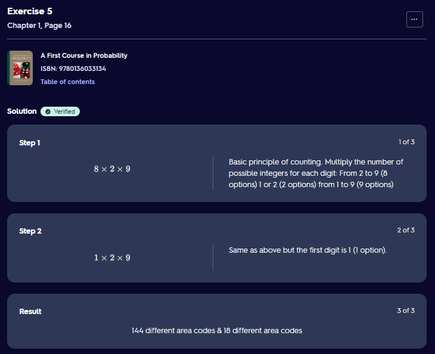

06.png

07a.png
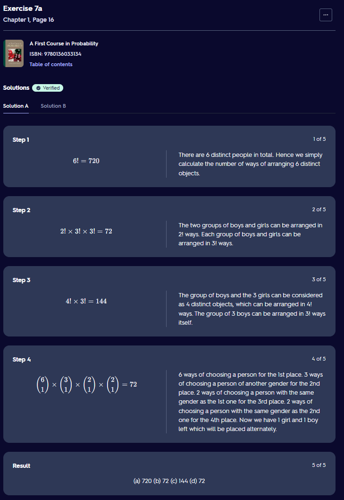

07b.png

07c.png
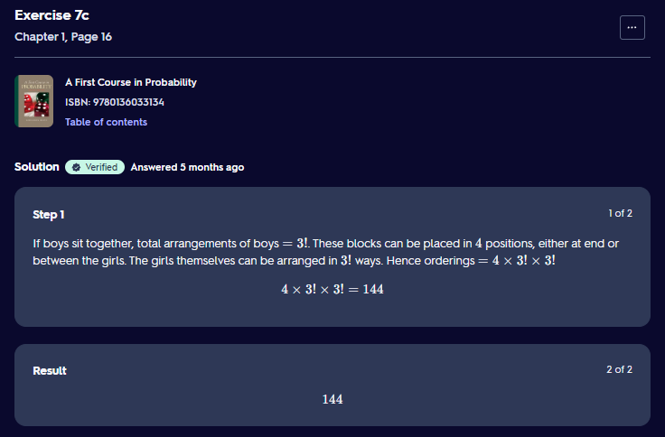

07d.png

08a.png
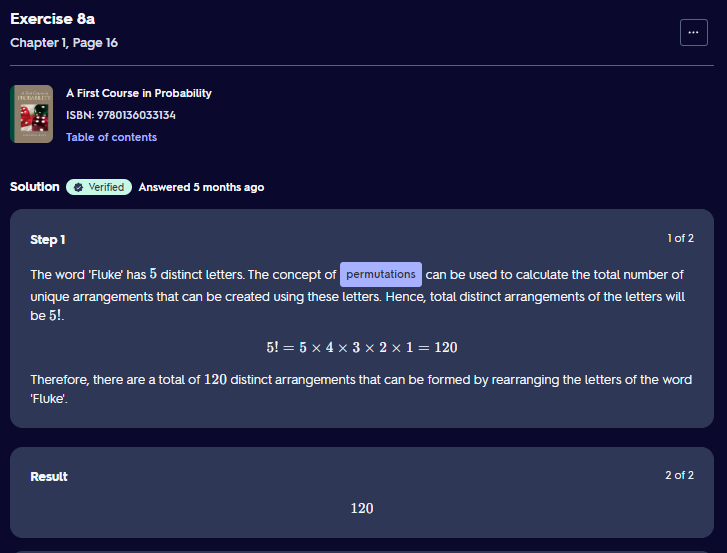

08b.png
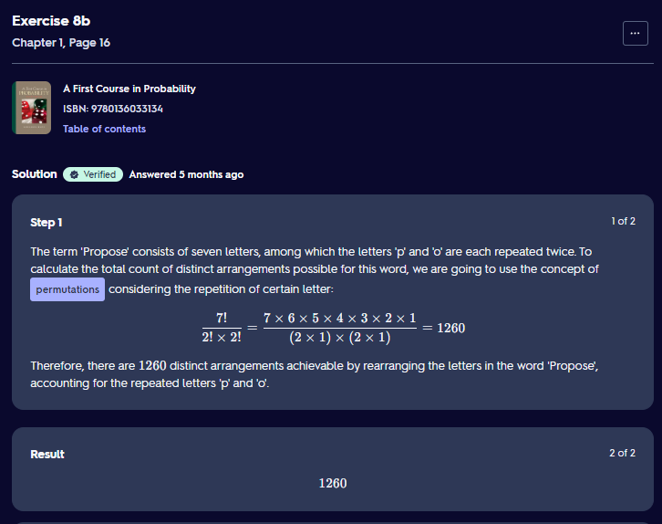

08c.png

08d.png
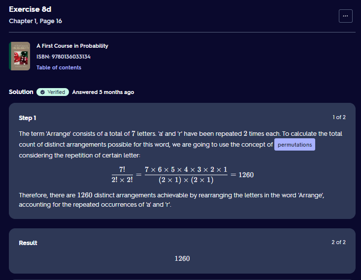

09.png

10a.png
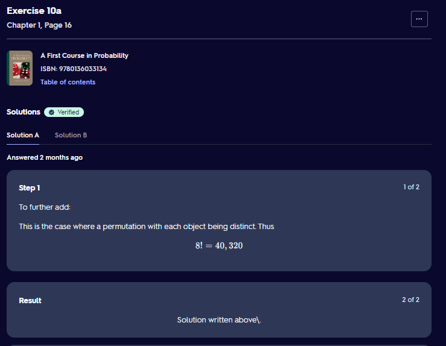

10b.png

10c.png

10d.png

10e.png
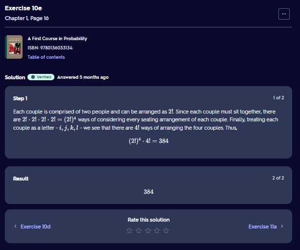

11a.png
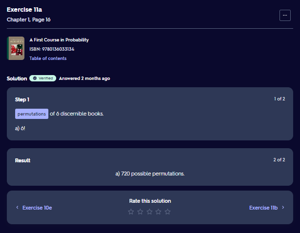

11b.png
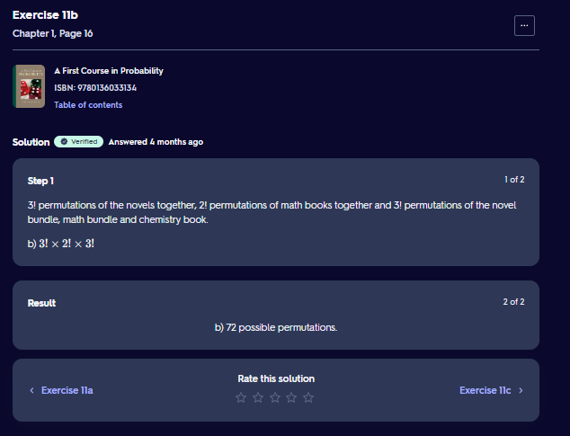

11c.png

12a.png

12b.png

13.png

14.png

15.png

16a.png

16b.png
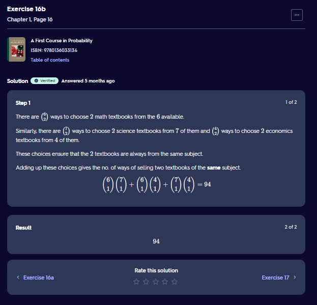

17.png

18.png
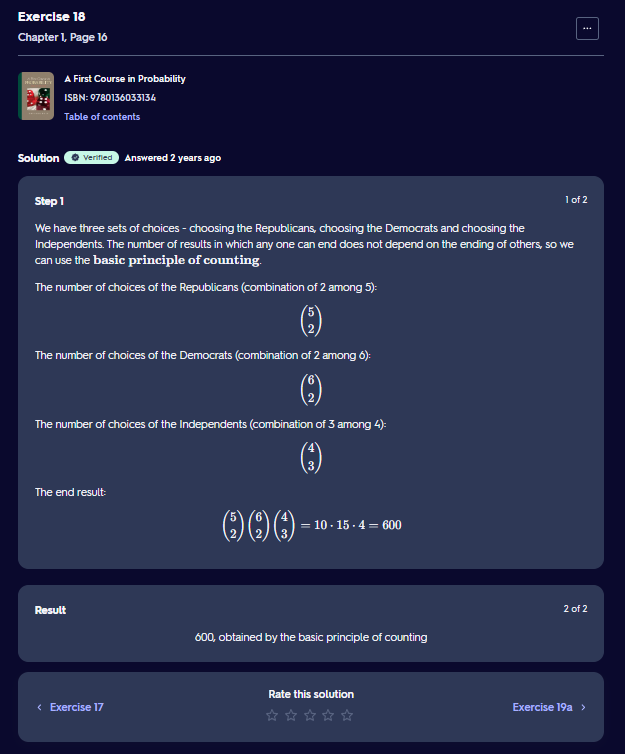

19a.png

19b.png

19c.png

20a.png

20b.png

21.png

22.png

23.png
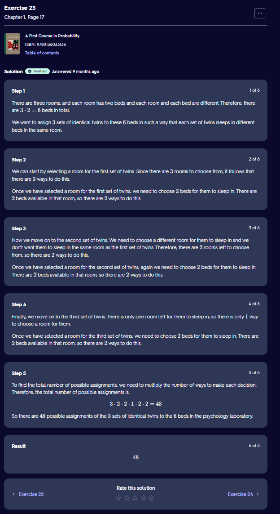

24.png

25.png
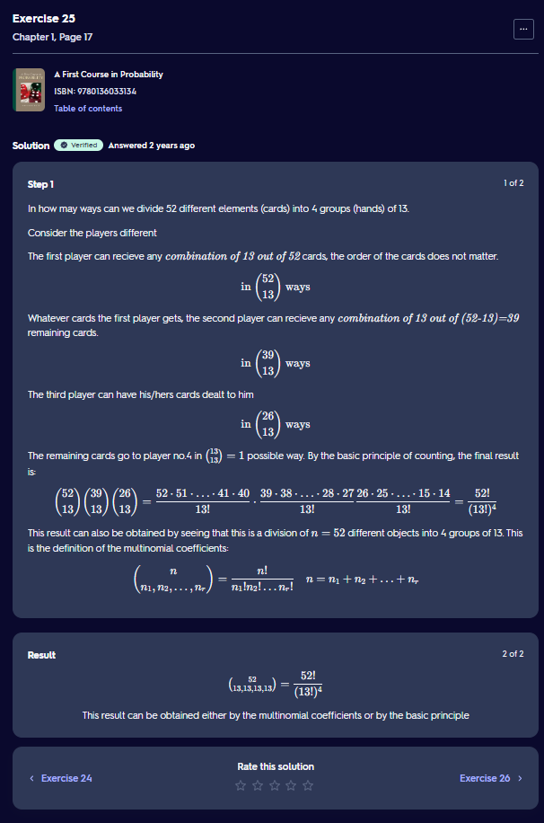

26.png

27.png

28.png

29.png

30.png

31.png

32.png

33a.png

33b.png

